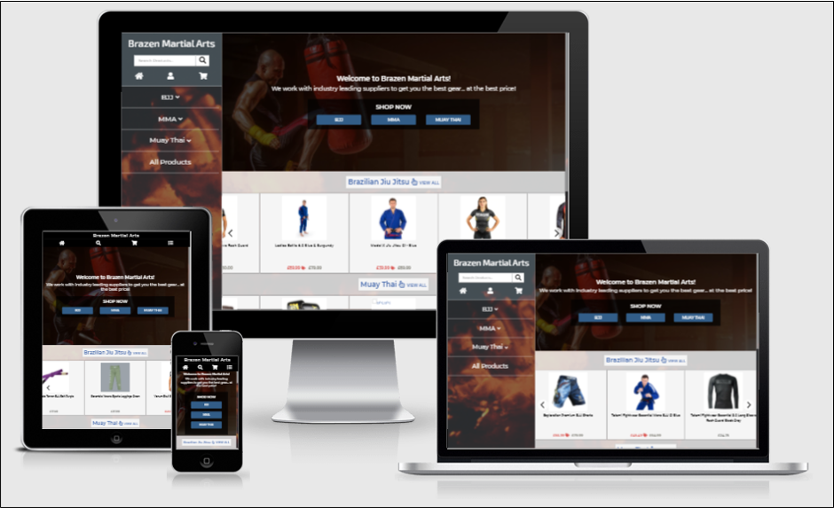
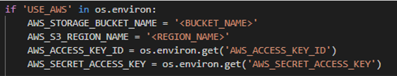
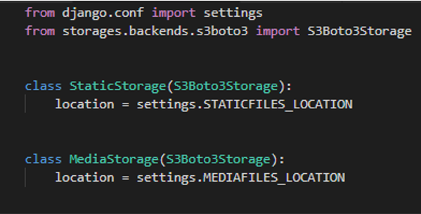
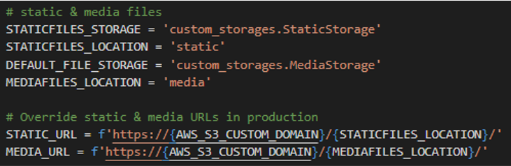

# Brazen MMA

This project is for educational purposes ONLY. No products are sold. Most of the prices are not accurate. No card transactions actually occur. Attempts to use
real card numbers will be declined. A list of test card numbers can
be found at [Stripe Docs Testing](https://stripe.com/docs/testing#regulatory-cards). Links to where the products can actually be purchased are included in the [Credits](#credits).

This project was developed on [Gitpod](https://www.gitpod.io/) and deployed to [Heroku](https://www.heroku.com/)

[View deployed website](https://brazenmartialarts.herokuapp.com/)

The main goal of this project is the development of an e-commerce website with the full stack framework Django. Brazen Martial Arts 
sells martial arts equipment for Brazilian Jiu Jitsu, Muay Thai, and Mixed Martial Arts. Brazen Martial Arts is built with user expeierence
as one of our central goals. The user can search the website for products they would like to purchase, add them to a bag, and checkout using Stripe payment.
When a user creates a profile all their past orders will be saved for them. Brazen Martial Arts hopes to provide a fulfilling user experience so as to 
encourage returning and happy customers.

## Table of Contents

- [UX](#ux)

## UX

### Strategy

For this project the focus is on developing a MVP (Minimum Viable Product). After users interact with the project
and feedback is received a new plan can be developed for implementing additional features to the project. My plan is
to develop an e-commerce website that retails martial arts equipment. I decided for my MVP that my products 
would consist of apparel for Brazilian Jiu Jitsu, Muay Thai, and Mixed Martial Arts with more products 
to come in future updates. My strategy consists of developing functionality for users to search for and 
view each product, add the product to a bag and then securely checkout. A user account would be useful for 
storing useful information such as billing and delivery information so if a user decides to buy more products
in the future, this would make their checkout quicker and smoother.

#### Product Objectives

This project provides value to the retailer by:
- Providing sales to consumers not lcoated within travel distince to the retailer.
- Providing customers with a good user experience so that users come to trust or enjoy shopping with this retailer.
- The website can help the retailer with understanding their customers needs better.
- Product management within the website can provide a useful way for the retailer to store information about
their products, customers, and orders.

#### User needs
- A satisfying user expierience through apropriate use of content, interactivity, navigation, and feedback.
- Easy checkout.
- Access to previous order details.
- A well designed database that allows customers to quickly find the product they are searching for.
- Anonymous checkout.
- Ability to create an account so user delivery details can be saved for a quicker future checkout.
- Accessible design.

### Scope

#### Functional Requirements

Browsing experience:

- The website should feature a search form so users can easily search for the product they are looking for.
- A product menu should be added as an additonal method of searching through products.
- There should be functionality present for filtering products by gender, and sorting products by name or price.
- As more users visit the website their feedback can be used to improve the browsing experience.

Shopping bag & checkout
- Include functionality for adding products to a shopping bag that a user can view and adjust until they are ready to checkout with their selected products.
- There must be a secure checkout page with sufficient feedback so that few errors occur during this process.

Database:
- There must be a database for storing product information, user details, and orders.

Feedback:
- User actions should be responded to with feedback from the website so a user is confident whether or not their actions have been successfully performed.

Registration:
- There should be a form for new users to register an account. The user should receive an email confirming that their account has been created and welcoming them to our website.
- Users should be notified when registration is successful or unsuccessful. An error should suggest why there was an error and how it can be fixed e.g.
 “Password does not match correct format.”

Login:
- There should be a form for registered users to log into their accounts. There should be an option for users to stay logged in so if they are regular users, 
they will not have to continuously log in.
- There should be an option for a user to create a new password if they have forgotten it.
- It should be obvious to the user when they are logged in. Display login/Register when a user is logged out, display Profile/log out when a user is logged in.
- Messages should be displayed to the user why their login attempt failed. e.g. "incorrect password/email."
- Logged in users should see a message informing them that their login was successful.

Profiles:
- Users should be able to view all their past orders, and update user information.

#### Content Requirements

Branding:
- Website surface should conform to retailer branding.

Browsing:
- The display page for search results should display information on products that influence buying decisions. Prices, discounts, images, product name, and brand
 should be included so a user can easily compare products and decide what they want to purchase.

Cart & Checkout:
- The cart should display the same content as the search result display pages for products the user has added to the cart. The total cost of the order should be displayed, 
and the number of items in the cart.
The checkout should have the same content as the cart with additional fields for entering contact details, delivery details, and billing details.

Cart & Checkout Feedback:
- Messages should appear informing the user what item has been added to cart if it was successful. If there is an error, an error message should appear with a possible fix;
 if no fix is possible then contact the retailer.
- The user should be informed if their checkout has been successful and receive an email with a copy of their order details.

#### Database Schema:

A relational database was used to store my data. My development database used was [SQLite](https://www.sqlite.org/index.html), and my deployed database used was
[Heroku Postgres](https://www.heroku.com/postgres) A relational database allowed me to connect data stored in separate tables through the use of foreign keys.

Product Model:
The product model stores information on products sold by this website.

| Key | Value Type | Purpose |
| ---- | ----- | --------------- |
| product_id | uuid | Unique identifier for a product. |
| name | str | The products name. Used for queries and displayed as content. |
| description | str | A description of the product. Used for quirires and displayed as content. |
| gender | str | Used to filter products according to the gender the product is designed for. |
| sale | boolean | Identifies if the product is on sale and discounted. This is true when rrp is not equal to price. |
| rrp | decimal | The reccommended retail price of the product. This is displayed as content. |
| price | decimal | The actual price this product is sold for. This is displayed as content. |
| category | str | Identifies a category the product belongs to. This is used to improve user queries. |
| product_type | str | Products also have a type that further classifies them and improves user queries. |
| image | image | This is an image of the product. This is displayed as content. |

ProductSizesStock Model:
The ProductSizesStock model stores information on a particular products sizes and available stock.

| Key | Value Type | Purpose |
| ---- | ----- | --------------- |
| product_sizes_stock_id | int | Unique identifier for this table. |
| product_id | int | Foreign key to the Product model. Identifies the product that this table belongs to. |
| size | str | The size of the product. Displayed as content to the user. |
| stock | int | The available stock of this product size. |

Order Model:
This model stores order details for the customer and retailer.

| Key | Value Type | Purpose |
| ---- | ----- | --------------- |
| order_id | int | Unique identifier for this table. |
| order_number | uuid | The order number for this order. Uniquely identifies the order. This is displayed as content to the user. |
| user_profile | int | Foreign key used to identify the user that this order belongs to. For anonymous users, this value is blank. |
| full_name | str | The users full name. Used as billing and delivery information. |
| email | str | The users email. Used to contact the user and send them a copy of their order. |
| phone_number | str | The users phone number. Used as alternative contact information. |
| country | str | The users country. Used as billing and delivery information. |
| postcode | str | The users postcode. Used as billing and delivery information. |
| town_or_city | str | The users town or city. Used as billing and delivery information. |
| street_address1 | str | The users street address (line 1). Used as billing and delivery information. |
| street_address2 | str | The users street address (line 2). Used as billing and delivery information. |
| county | str | The users county/state. Used as billing and delivery information. |
| date | date | The date and time the order was placed. Used as billing and delivery information. |
| delivery_cost | decimal | The delivery cost of the order. Used as billing information. |
| order_total | decimal | The sub-total of the order. Used as billing information. |
| grand_total | decimal | The grand_total of the order. Used as billing information. |
| original_bag | str | A copy of the users ordered products. |
| stripe_pid | str | The users stripe payment intent id. |

OrderLineItem Model:
This model stores the products that a user ordered and is attached to their order in the Order model.

| Key | Value Type | Purpose |
| ---- | ----- | --------------- |
| order_line_item_id | int | Unique identifier for this table. |
| order | uuid | Foreign key attached to the Order model. Identifies which order this table belongs to. |
| product | uuid | Foreign key attached to the Product model. Identifies which product was ordered. |
| product_size | str | The size of the ordered product. |
| quantity | int | The quantity of this product the user ordered. |
| lineitem_total | decimal | The total of this order lineitem. quantity * product.price |

UserProfile Model:
This model stores the users default delivery and billing information.

| Key | Value Type | Purpose |
| ---- | ----- | --------------- |
| UserProfile_id | int | Unique identifier for this table. |
| user | int | A foreign key that identifies the User that this table belongs to. |
| default_full_name | str | The users full name. For autofilling the checkout form on the users next checkout. |
| default_email | str | The users email. For autofilling the checkout form on the users next checkout. |
| default_phone_number | str | The users phone_number. For autofilling the checkout form on the users next checkout. |
| default_street_address1 | str | The users street_address1. For autofilling the checkout form on the users next checkout. |
| default_street_address2 | str | The users street_address2. For autofilling the checkout form on the users next checkout. |
| default_town_or_city | str | The users town or city. For autofilling the checkout form on the users next checkout. |
| default_postcode | str | The users postcode. For autofilling the checkout form on the users next checkout. |
| default_county | str | The users county. For autofilling the checkout form on the users next checkout. |
| default_country | str | The users country. For autofilling the checkout form on the users next checkout. |

Allauth User Model:
This model stores the users registration information. I did not create this model. It is the default Allauth User model.

#### Database Relationships

ProductSizesStock model:
- This model has a many-to-one relationship with the Product model.
- The "product_id" key has a value that is a foreign key identifying the Product that this table belongs to.
- A Product may have many sizes.

Order model:
- This model has a many-to-one relationship with the UserProfile model.
- The "user_profile" key has a value that is a foreign key identifying the UserProfile that this table belongs to.
- A UserProfile may have many orders.

OrderLineItem model:
- This model has two many-to-one relationships. One to the Order model, and another to the Product model.
- The "order" key has a value that is a foreign key identifying the Order that this table belongs to.
- An Order may have many orderlineitems attached to it.
- The "product" key has a value that is a foreign key identifying the Product that this table belongs to.
- A Product may have many orderlineitems attached to it.

UserProfile model:
- This model has a one-to-one relationship with the Allauth User model.
- The "user" key has a value that is a foreign key identifying the User that this table belongs to.
- The User model has only one UserProfile attached to it.

### Structure

The conceptual model for organising the content of this website will be that of a shopping catalogue.
Products are organised into different categories and types that a user can select from, similar to the index of
a shoppping catalogue.

#### Interaction Design

Product Search:
 - Two methods of searching for products exist. A user can use a search form to submit a query that identifies 
 key words in product descriptions, names, product_types, category, and gender. Alternatively, a product menu is provided
 that defines all products as belonging to particular categories with sub-categories I have named "product_types".
- After a list of products are displayed, sorting and filtering functionality can assist in narrowing down the users search.
Products can be sorted by asc/desc price, and alphabetically by asc/desc name. Products can be filtered by gender or if a
product is discounted.
- Breadcrumbs let a user know where they are at all times while searching for products.
- I found the following to be helpful in designing my navigation. [Website Navigation Examples](https://www.mockplus.com/blog/post/website-navigation-examples-practices)

Header:
- The most important navigational elements are contained within the header. The product menu, bag, accounts, and home page buttons are included here.
This should ensure the user has access to the most important interaction features at all times and never feels lost within the website.

#### information Architecture

Product Organistaion:
- The task of categorising products is difficult as the cateogories must not be too general nor too specific. Too many options to select from can frustrate the user
as too much time is spent searching through lists. Displaying all products at once would be as bad as displaying too many categories to select from.
- I have first defined my products by the martial art they were designed for, these being BJJ, MMA, and Muay Thai. The products are categorised further 
into sub categories specific to the main categories. BJJ > shorts displays BJJ shorts, while MMA > shorts displays MMA shorts. At most there should be 
5 sub categories.
- BJJ > Shorts, GI, Belts, Spats, Rash Guards.
- MMA > Gloves, Shorts, Handwraps, Mouth Guards, Shin Guards.
- Muay Thai > Gloves, Shorts, Handwraps, Mouth Guards, Shin Guards.

Checkout:
- The checkout menu should display a list of all items that have been added to the cart, the item image, name, price, quantity, and size.
- Options for removing items from the cart should be available.

### Skeleton

I developed a set of wireframes as my projects Skeleton for small and large screen widths.
My wireframes were developed using [JustInMind](https://www.justinmind.com/?utm_medium=cpc&utm_source=google&utm_campaign=1063145459&utm_term=justinmind_e&gclid=Cj0KCQjwmIuDBhDXARIsAFITC_7fJ-f91qPfUBKpKEnOQhcGG5Y3Ek848l20UUVZ8MjCnlbMRApU_DkaAmqnEALw_wcB)
[View skeleton wireframes](WIREFRAMES.md)

### Surface 

- The design of the website should be accessible with text that has acceptable constrast with its background.
- All designs should confirm to the branding of the retailer.
- The colours used should be dark themed as this is a website selling combat apparel.
- Buttons are highlighted with bootstrap classes. Error messages are displayed as red, and success messages are displayed as green.
- Background images help give more depth to the page.

## Technologies used

- [HTML5](https://www.w3schools.com/html/default.asp) - Used for structuring and presenting content.
- [CSS3](https://www.w3schools.com/css/default.asp) - Used to style the HTML in accordance with the project wireframes.
- [JavaScript](https://www.w3schools.com/js/default.asp) - Used to make the project interactive and enchance user experience.
- [JQuery](https://jquery.com/) - Used to simplify DOM manipulation and JavaScript.
- [Python](https://www.python.org/) - Used to handle the backend.
- [Django](https://www.djangoproject.com/) - The full stack framework used for developing this project.
- [Google Chrome Developer Tools](https://developer.chrome.com/docs/devtools/) - Aided with responsive design, accessibility, and debugging.
- [Gitpod](https://www.gitpod.io/) - The project was developed on the Gitpod IDE.
- [Git](https://git-scm.com/) - Used to track website changes.
- [Github](https://github.com/) - This hosted my repository and changes made with Git.
- [Heroku](https://www.heroku.com/) - Used to deploy my live website.
- [Heroku Postgres](https://elements.heroku.com/addons/heroku-postgresql) - Used to store my database.
- [Stripe](https://stripe.com/gb?utm_campaign=paid_brand-UK_en_Search_Brand_Stripe-2032860449&utm_medium=cpc&utm_source=google&ad_content=355351450259&utm_term=stripe&utm_matchtype=e&utm_adposition=&utm_device=c&gclid=Cj0KCQjw9YWDBhDyARIsADt6sGa0SXRpd16FfP8t-rfKZR8WthMn32xRCTgIhTPIPWMktdJvNODppUIaAlXbEALw_wcB) - Used for secure card payment.
- [Amazon Web Services S3](https://aws.amazon.com/free/?all-free-tier.sort-by=item.additionalFields.SortRank&all-free-tier.sort-order=asc&awsf.Free%20Tier%20Categories=categories%23storage&trk=ps_a134p000006gB41AAE&trkCampaign=acq_paid_search_brand&sc_channel=PS&sc_campaign=acquisition_GB&sc_publisher=Google&sc_category=Storage&sc_country=GB&sc_geo=EMEA&sc_outcome=acq&sc_detail=aws%20s3&sc_content=S3_e&sc_matchtype=e&sc_segment=474715198033&sc_medium=ACQ-P|PS-GO|Brand|Desktop|SU|Storage|S3|GB|EN|Text&s_kwcid=AL!4422!3!474715198033!e!!g!!aws%20s3&ef_id=Cj0KCQjwmIuDBhDXARIsAFITC_6U1FNtx6V72D0gASj7APTZkEppd-zDhS63T-m-aJ9Bw1gYn_gi7vcaArEqEALw_wcB:G:s&s_kwcid=AL!4422!3!474715198033!e!!g!!aws%20s3) - Used to store my static and media files.
- [Flickity](https://flickity.metafizzy.co/) - Used for creating carousels
- [Toastr](https://github.com/CodeSeven/toastr) - Used for displaying message toasts.
- [Bootstrap](https://getbootstrap.com/) - Used for creating dropdown menus, grids, and styling.
- [Font Awesome](https://fontawesome.com/) - Used for displaying icons within buttons primarily.
- [Python module requirements installed with PIP3](requirements.txt) - Features used for the backend.
- [Gmail](https://mail.google.com/) - Used to send emails.

## Testing

[View Tests](TESTING.md)

## Deployment

My project was deployed to [Heroku](https://www.heroku.com/) with my static and media files stored on [Amazon Web Services S3](https://aws.amazon.com/free/?all-free-tier.sort-by=item.additionalFields.SortRank&all-free-tier.sort-order=asc&awsf.Free%20Tier%20Categories=categories%23storage&trk=ps_a134p000006gB41AAE&trkCampaign=acq_paid_search_brand&sc_channel=PS&sc_campaign=acquisition_GB&sc_publisher=Google&sc_category=Storage&sc_country=GB&sc_geo=EMEA&sc_outcome=acq&sc_detail=aws%20s3&sc_content=S3_e&sc_matchtype=e&sc_segment=474715198033&sc_medium=ACQ-P|PS-GO|Brand|Desktop|SU|Storage|S3|GB|EN|Text&s_kwcid=AL!4422!3!474715198033!e!!g!!aws%20s3&ef_id=Cj0KCQjwmIuDBhDXARIsAFITC_6U1FNtx6V72D0gASj7APTZkEppd-zDhS63T-m-aJ9Bw1gYn_gi7vcaArEqEALw_wcB:G:s&s_kwcid=AL!4422!3!474715198033!e!!g!!aws%20s3).

You can view my deployed project at [https://brazenmartialarts.herokuapp.com/](https://brazenmartialarts.herokuapp.com/)

### Live Deployment

#### Heroku Deployment

1. Login/Register to Heroku. From your dashboard, select "New" then "Create new app" from the dropdown menu.
1. Name your app and choose the region closest to you. Select "Create app".
1. On your dashboard select the "Resources" tab. Here you can search for "Heroku Postgres" and select it as an add-on.
1. Login to Heroku from your terminal with:
    - `heroku login`
    - Alternatively, if this fails, you can use `heroku login -i`
1. If you have not followed the steps for [Local Deployment](#local-deployment), then the python modules "dj_database_url" and "psycopg2" need to be installed.
Enter the following into your terminal to install these.
    - `pip3 install dj_database_url`
    - `pip3 install psycopg2`
1. So Heroku knows what modules to install, save your installed modules in a requirements.txt file by entering the following into the terminal:
    - `pip3 freeze > requirements.txt`
1. In your settings.py file, import dj_database_url by adding the following to your files head.
    - `import dj_database_url`
1. Replace the default SQLite "DATABASES" configuration with:
    - `DATABASES = {'default': dj_database_url.parse(os.environ.get('<DATABASE_URL>'))}`
    - Where <DATABASE_URL> is the url of your database.
    - Your database url can be obtained by going to the "settings" tab within your Heroku dashboard. It will be saved as a config variable after you added Heroku Postgres to your app. Alternatively,
    enter `heroku config` into your teminal to reveal your config vars.
    - It is advised to keep your database url private by adding it to an env.py file.
1. Apply migrations to your new database configuration with:
    - `python3 manage.py makemigrations`
    - `python3 manage.py migrate`
    - `heroku run python3 manage.py makemigrations`
    - `heroku run python3 manage.py migrate`
1. Create a superuser in your terminal with:
    - `python3 manage.py createsuperuser`
1. In the "settings" tab of your Heroku dashboard, select "Reveal config vars". The following config vars are used in this project.

    | Key | Value |
    | ----- | ----- |
    | AWS_ACCESS_KEY_ID | Obtained from AWS |
    | AWS_SECRET_ACCESS_KEY | Obtained from AWS |
    | DATABASE_URL | Added automatically when Heroku Postgres is added to your app |
    | EMAIL_HOST_PASS | Your Gmail host password |
    | EMAIL_HOST_USER | Your Gmail email |
    | SECRET_KEY | Your Django secret key |
    | STRIPE_PUBLIC_KEY | Obtained from Stripe |
    | STRIPE_WH_SECRET | Obtained from Stripe |
    | USE_AWS | True |
1. Create a Procfile by first installing "gunicorn" with:
    - `pip3 install gunicorn`
1. After installation is complete, create a "Procfile" and add the following:
    - `web: gunicorn <APP_NAME>.wsgi:application`
    - Where <APP_NAME> is the name of your folder that contains your settings.py file.
1. Temporarily disable the collection of static files before deploying to Heroku. Static files will be
saved to AWS S3. Add "DISABLE_COLLECTSTATIC" with a value of "1" to your config variables. This can be deleted after
deploying the Heroku is complete.
1. In your settings.py add `['<HEROKU_APP_NAME>.herokuapp.com', 'localhost']` to ALLOWED_HOSTS.
    - Where <HEROKU_APP_NAME> is your Heroku app name.
1. Commit your changes and push to Github.
1. Initialise your Heroku git remote with the following in your terminal:
    - `heroku git:remote -a <HEROKU_NAPP_NAME>`
    - Where <HEROKU_APP_NAME> is your heroku app name.
1. Finally push to Heroku with the following in your terminal:
    - `git push heroku master`
1. Automatic deployments can be enabled from the "deploy" tab within your Heroku dashboard so everything you push your code to Github, it will be pushed to Heroku also.

#### Adding Static and Media files to AWS

1. Login/register to Amazon Web Services (AWS) so you can save your static and media files to its S3 cloud storage.
1. Open the AWS management console within "account". Go to "services" and search for "S3".
1. Create a new bucket within S3.
1. Name your bucket and select the region closest to you.
1. Uncheck "block all public access" so that your bucket will be public. Confirm then create your bucket.
1. Open your new bucket and navigate to "settings".
1. Navigate to the "properties" tab and enable static website hosting.
1. Within the "permission" tab, paste in the following CORS Configuration:
    - `[{"AllowedHeaders": ["Authorization"], "AllowedMethods": ["GET"], "AllowedOrigins": ["*"], "ExposeHeaders": []}]`
1. Within the "Bucket Policy" tab, select "policy generator"
    - Set policy type to "s3 bucket policy".
    - Allow all principles by setting its value as *
    - The "Actions" is "GetObject".
    - Add in your ARN, this can be found in the "Bucket Policy" tab within the "Permissions" tab of your bucket.
    - Select "Add statement" then "Generate Policy".
    - Copy the policy and paste it into the bucket policy editor.
    - add "/*" (without quote marks) to the end of your "resource" key then save.
    - In the "Access Control List" set the list objects permission to everyone.
1. Within "services" on your AWS management console, search for "IAM".
    - Go to "groups" within the IAM dashboard then "Create new group".
    - Skip policies and continue until the group is created. 
    - Navigate to "Policies" within the dashboard then "create policy".
    - Select the JSON tab then "import managed policy".
    - Import "AmazonS3FullAccess".
    - Delete the Resource key value and replace it with:
        - `["<ARN>", "<ARN>/*"]`
        - Where ARN is your ARN.
    - Select "Review policy", then name and describe your policy. Select "Create Policy".
    - Return to "Groups", select your group then "Attach policy" and attach the policy you just created.
    - Navigate to the "Users" tab within the IAM dashboard and add a user.
    - Give your user a name and programmatic access.
    - Select your bucket with your attached policy.
    - Download the .CSV file. Store this file somewhere safe as it cannot be downloaded again.
1. In your terminal install boto3 and django-storages with:
    - `pip3 install boto3`
    - `pip3 install django-storages`
1. Freeze these modules in your terminal with:
    - `pip3 freeze > requirements.txt`
1. Add "storages" to your list of INSTALLED_APPS in settings.py
1. Add the following to your settings.py file to connect to S3:
    - 
    - Where USE_AWS is True in your Heroku config vars. So only your Heroku app has access to S3.
    - Where <BUCKET_NAME> and <REGION_NAME> are your bucket name and region name respectively.
    - Where AWS_ACCESS_KEY_ID and AWS_SECRET_ACCESS_KEY are the values from your .CSV file.
    - Add the values of your .CSV file as config variables within Heroku.
    - Delete your DISABLE_COLLECTSTATIC config var as static files will be added to S3 now.
1. Add the following below AWS_SECRET_ACCESS_KEY within settings.py:
    - `AWS_S3_CUSTOM_DOMAIN = f'{AWS_STORAGE_BUCKET_NAME}.s3.amazonaws.com'`
1. Create a file called "custom_storages.py" and add the following:
    - 
1. Beneath your bucket configuration in settings.py add the following:
    - 
1. Commit and push your changes. Use `git push heroku master` in your terminal if you do not have automatic deployment enabled on Heroku.
1. Your Heroku app should now be saving static and media files to S3.  

### Local Deployment

1. Open your favourite IDE with Git installed.
1. Click on the "Code" button at the top of this repository.
1. Copy the HTTPS URL.
1. Open a new terminal in your IDE and use the command "git clone" followed by the copied url.
    - `git clone https://github.com/paulloy/msp4-brazen-mma.git`
1. Click enter and wait for your local clone to download.
1. You should now have access to a clone of this project.
1. To install all python module requirements, enter the following command into your terminal:
    - `pip3 install -r requirements.txt`

## Credits

### Media

The following images were sourced from:
- [Burning-Coals.gif](https://scitechdaily.com/images/Burning-Coals.gif)
- [Home Page Hero Image](https://www.verywellfit.com/thmb/rYgOA5OFD9-eca1GmrnS8g4NJis=/3000x2002/filters:no_upscale():max_bytes(150000):strip_icc()/heavy-bag-work-mrbig_photography-58f7d4f75f9b581d5982bd51.jpg)

### Content

- Wireframes were developed using [JustInMind](https://www.justinmind.com/)
- Additional fonts used in this project were acquired from [Google Fonts](https://fonts.google.com/)
- The image at the top of this README was produced on [Am I Responsive?](http://ami.responsivedesign.is/)

### Books I read
- [The Elements of User Experience: User-Centered Design for the Web - Jesse James Garrett](https://www.amazon.co.uk/Elements-User-Experience-User-Centered-Design/dp/0735712026)
    - This helped me with understanding UX better.
- [JavaScript & JQuery: Interactive front-end web development - Jon Duckett](https://www.amazon.co.uk/JavaScript-JQuery-Interactive-Front-End-Development/dp/1118531647/ref=sr_1_2?dchild=1&keywords=JavaScript+%26+JQuery%3A+Interactive+front-end+web+development+-+Jon+Duckett&qid=1617059539&s=books&sr=1-2)
    - This book helped me learn how to use AJAX.
