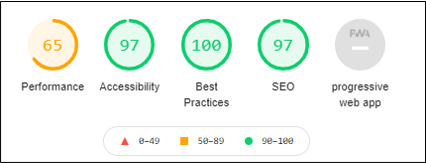
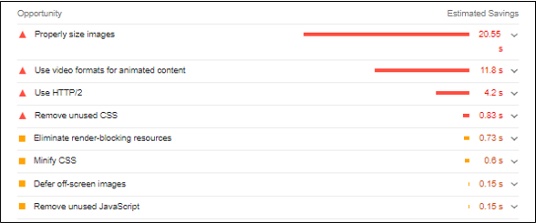
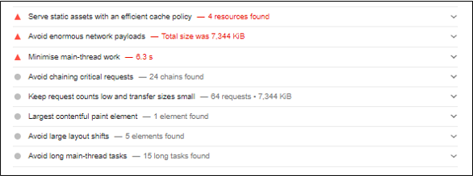
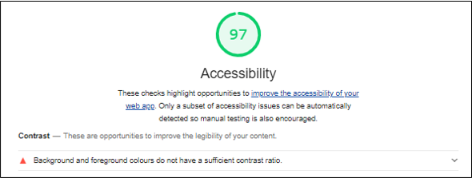
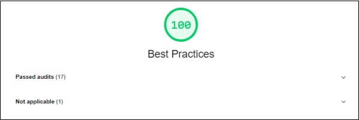
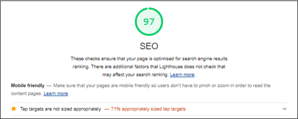

# Testing

## bag

### Test events 

| ID | Event | Expected Response | Pass / Fail ? |
| ---- | ----- | --------------- |    :-----:    |
| 1.01 | Update quantity of product with a value beyond the min/max values of 1 and 99. | Do not submit form. Display "Value must be less than or equal to 99". | Pass |
| 1.02 | Update quantity of product with a non-int number. | Do not submit form. Display "Please enter a valid value". | Pass |
| 1.03 | Update quantity of product with a valid value. | Call  and redirect to . Display toast. | Pass |
| 1.04 | Using Dev tools, change type of input from number to text, then submit form. | Redirect to  and display error toast. | Pass [1] |
| 1.05 | Remove product from bag | Redirect to  and display toast confirming product removal. Product should now be absent from the bag. | Pass |
| 1.06 | Using Dev tools, delete csrf_token input and submit update form. | Display 403 Forbidden error. | Pass |
| 1.07 | Using Dev tools, change update forms action so an invalid product_id is submitted. | Redirect to  and display error toast. | Pass [1] |
| 1.08 | Using Dev tools, change value of hidden size input for remove form to a value that does not exist in the bag. | Redirect to  and display error toast. | Pass [1] |
| 1.09 | Select 'Keep Shopping'. | Direct user to  | Pass |
| 1.10 | Select 'Checkout'. | Direct user to  | Pass |
| 1.11 | Select product image, or product name. | Direct user to  (The products individual product page) | Pass |
| 1.12 | Select arrows next to quantity input. | Adjust value within quantity input ± 1. Do not change value to a number beyond the min/max range. | Pass |
| 1.13 | Access bag/remove/<product_id> by direct url input. | Redirect to  and display error toast. | Pass [1] |
| 1.14 | Access bag/add/<product_id> by direct url input. | Redirect to  and display error toast. | Pass [1] |
| 1.15 | Access bag/adjust/<product_id> by direct url input for a product that is not in the bag. | Redirect to  and display error toast. | Pass [1] |
| 1.16 | Bag is empty. | Display message that bag is currently empty. Hide Checkout button. | Pass |

**NOTES**
 - [1]: As of commit *695f495*, these tests now Pass.

### Python Testing
- [test_views.py](bag/test_views.py)

### Validation

#### HTML
- [bag.html](bag/templates/bag/bag.html)
    - WARNING: The document is not mappable to XML 1.0 due to two consecutive hyphens in a comment.
    - 28/03/21: This file is now valid. No errors found.

#### CSS
 - [bag.css](bag/static/css/bag.css)
    - No errors found.
    - 28/03/21: This file is now valid. No errors found.

#### JS
 - [bag.js](bag/static/js/bag.js)
    - One undefined variable: $
    - One unused variable: $displayQuantity
    - 28/03/21: This file is now valid. No errors found.

## checkout

### Test events

| ID | Event | Expected Response | Pass / Fail ? |
| ---- | ----- | --------------- |    :-----:    |
| 2.01 | Anonymous User can checkout | Display  with order confirmation. | Pass [1] |
| 2.02 | Submit form with empty required fields | Notify user to fill in required fields. | Pass |
| 2.03 | Submit form with empty payment field | Display error within the card div. | Pass |
| 2.04 | Submit form with empty optional fields | Display  with order confirmation. | Pass |
| 2.05 | Submit form with empty optional fields | Display  with order confirmation. | Pass |
| 2.06 | Submit form as a logged in user. | Display  with order confirmation. | Pass |
| 2.07 | Return to checkout after successful checkout. | Redirect to  | Pass [1] |
| 2.08 | Checkout with info saved. | Info should be auto filled for next checkout. | Pass |
| 2.09 | Select login as an anonymous user. | Direct user to  | Pass |
| 2.10 | Select 'adjust bag' button. | Direct user to  | Pass |
| 2.11 | Select 'view order summary' button. | Toggle the order summary. (For small screen widths where order summary is hidden) | Pass |
| 2.12 | Access  by url with an empty bag. | Redirect the user to  and display an error. | Pass [2] |
| 2.13 | Access  by url with invalid order ID. | Redirect the user to  and display an error. | Pass [1] |
| 2.14 | Access  by url. | Display 405 error. | Pass |
| 2.15 | Access  by url. | Display 405 error. | Pass |
| 2.16 | Checkout with Stripe test card number: 4000002500003155. Fail authentication. | Display error within the card div. | Pass |

**NOTES**
 - [1]: As of commit *7b5923e*, these tests now Pass.
 - [2]: As of commit *2486c93*, this test now Passes.
 - The patch to 2.12 fixed 2.07.
 - The expected response of test 2.14 & 2.15 was incorrect and has been updated. 

### Python Testing

- [test_views.py](checkout/test_views.py): tests for [views.py](checkout/views.py)
- [test_models.py](checkout/test_models.py): tests for [models.py](checkout/models.py)
- [test_forms.py](checkout/test_forms.py): tests for [forms.py](checkout/forms.py)

### Validation

#### Python
 - All python was validated according to PEP8 standards.

#### HTML
 - [checkout.html](checkout/templates/checkout/checkout.html)
    - Element p not allowed as child of element strong in this context.
    - 28/03/21: This file is now valid. No errors found.
 - [checkout_success.html](checkout/templates/checkout/checkout_success.html)
    - No errors found.

#### CSS
 - [checkout.css](checkout/static/css/checkout.css)
    - No errors found.
 - [checkout_success.css](checkout/static/css/checkout_success.css)
    - No errors found. 

#### JS
 - [checkout.js](checkout/static/js/checkout.js)
    - One undefined variable: $
    - 28/03/21: This file is now valid. No errors found.
 - [stripe-elements.js](checkout/static/js/stripe-elements.js)
    - Missing semicolon.
    - 'template literal syntax' is only available in ES6 (use 'esversion: 6').
    - undefined variable: $
    - undefined variable: Stripe
    - 'Stripe' is defined in the Stripe script link in [base.html](templates/base.html)
    - 28/03/21: This file is now valid. No errors found.

## profiles

### Test events

| ID | Event | Expected Response | Pass / Fail ? |
| ---- | ----- | --------------- |    :-----:    |
| 3.01 | Selecting an order number | Direct user to  and display an info-message that this is a past order confirmation. | Pass |
| 3.02 | Selecting an order toggle button | Display a link to  titled 'View Order Summary.' Display a list of all products ordered. Display grand total of order. | Pass |
| 3.03 | Selecting 'View Order Summary.' | Direct user to  and display an info-message that this is a past order confirmation. | Pass |
| 3.04 | Selecting 'View Order Summary.' | Direct user to  and display an info-message that this is a past order confirmation. | Pass |
| 3.05 | Select a product name | Direct user to  | Pass |
| 3.06 | Submit empty form. | Page should reload with the form containing no values. | Pass |
| 3.07 | Submit form with values added. | Page should reload with submitted fields autofilled. | Pass |
| 3.08 | Navigate to  after updating default delivery info. | All the same orders should be displayed to the user. | Pass |
| 3.09 | Navigate to  after updating default delivery info. | Only the filled in fields should be automatically filled on the checkout form. | Pass |
| 3.10 | With no delivery info saved, place an order at the checkout and select 'save this delivery information' checkbox. | Default Delivery Info should now be autofilled upon returning to . | Pass |
| 3.11 | Navigate to  while not logged in. | Direct user to log in page. | Pass |
| 3.12 | Navigate to  while not logged in. | Direct user to log in page. | Pass |
| 3.13 | Navigate to  while not logged in. | Direct user to log in page. | Pass[1] |

**NOTES**
- As of commit *6b03dc8* this test now passes.

### Validation

#### Python
 - All python was validated according to PEP8 standards.

#### HTML
 - [order-history.html](profiles/templates/profiles/order-history.html)
    - WARNING: The document is not mappable to XML 1.0 due to two consecutive hyphens in a comment.

#### CSS
 - [profile.css](profiles/static/css/profile.css)
    - No errors found.

#### JS
 - [profile.js](profiles/static/js/profile.js)
    - No errors found.

---

## base

### Test Events

| ID | Event | Expected Response | Pass / Fail ? |
| ---- | ----- | --------------- |    :-----:    |
| 4.01 | Select Home page button. | Direct to  | Pass |
| 4.02 | Select Account button while anonymous. | Open #account and display options for logging in or registering. | Pass |
| 4.03 | Select Register link. | Direct to Allauth registration page. | Pass |
| 4.04 | Select Login link. | Direct to Allauth login page. | Pass |
| 4.05 | Select Account button while logged in as a superuser. | Display links for adding a product, order history, update delivery info, and logout. | Pass |
| 4.06 | Select 'Add a product' link. | Direct user to  | Pass |
| 4.07 | Select 'Order History' link. | Direct user to  | Pass |
| 4.08 | Select 'Update Delivery Info' link. | Direct user to  | Pass |
| 4.09 | Select 'Logout' link. | Direct user to Allauth Sign out page. | Pass |
| 4.10 | Login as regular user and view #accounts menu. | Display links for order history, update delivery info, and logout. | Pass |
| 4.11 | Select 'My Shopping Bag' button. | Display #bag-menu | Pass |
| 4.12 | Open #bag-menu with an empty bag. | Checkout button should be hidden if bag is empty. Message should display that bag is empty. | Pass[1] |
| 4.13 | Add a product then view #bag-menu | Added product is displayed in #bag-menu | Pass |
| 4.14 | Select 'View Bag'. | Direct user to  | Pass |
| 4.15 | Select 'Checkout'. | Direct user to  | Pass |
| 4.16 | Select a product image. | Direct user to  | Pass |
| 4.17 | Select a product name. | Direct user to  | Pass |
| 4.18 | Adding more products to bag. | Number of products in bag changes. | Pass[1] |
| 4.19 | Adding more products to bag. | Sub-total in bag changes. | Pass |
| 4.20 | Focus on search form input. | Hide #block-content and display a preview of the users search query with ajax request. | Pass |
| 4.21 | Blur on search form input while mouse is not hovering the #overlay-menu. | Hide #overlay-menu and display #block-content. | Pass |
| 4.22 | Blur on search form input while mouse is hovering the #overlay-menu. | Do not hide #overlay-menu. | Pass |
| 4.23 | On mouseleave on #overlay-menu while search form input is not focused on. | Hide #overlay-menu and display #block-content. | Pass |
| 4.24 | Enter search criteria for non-existant product. | Display message that no products are found and hide 'View Full Results' button. | Pass |
| 4.25 | Select 'View Full Results' button. | Display ?=q=<user input> | Pass |
| 4.26 | Submit search form with enter key, or selecting its submit button. | Display ?=q=<user input> | Pass |
| 4.27 | SM: Select Home page button. | Direct to  | Pass |
| 4.28 | SM: Select #toggle-sm-search button. | Display #search-menu-sm | Pass |
| 4.29 | SM: Submit #search-menu-sm | Display ?=q=<user input> | Pass |
| 4.30 | SM: Select #toggle-sm-bag button with items in bag. | Display #bag-sm-menu and hide #block-content. | Pass |
| 4.31 | SM: Select #toggle-sm-bag button with an empty bag. | Display #bag-sm-menu with View Bag and Checkout buttons hidden. Display message that bag is empty. | Pass |
| 4.32 | SM: Select 'View Bag' button. | Direct user to  | Pass |
| 4.33 | SM: Select 'Checkout' button. | Direct user to  | Pass |
| 4.34 | SM: Select 'Checkout' button. | Direct user to  | Pass |
| 4.35 | SM: Select Product image. | Direct user to  | Pass |
| 4.36 | SM: Select Product name. | Direct user to  | Pass |
| 4.37 | SM: Add products to bag then view it. | Sub-total and total products in bag should change. | Pass |
| 4.38 | SM: Add products so that the length of items is greater than 3. | Display Sub-total, total products, View Bag, and Checkout at the bottom of the bag for a user who scrolls to the bottom. | Pass |
| 4.39 | SM: Select #toggle-side-nav | Display #side-nav and hide #block-content. | Pass |
| 4.40 | SM: Select Accounts | Display Accounts submenu. | Pass |
| 4.41 | SM: Select MMA, BJJ, or Muay Thai. | Display category product_types submenus. | Pass |
| 4.42 | SM: Select product_type. GI, Belts, Spats, etc. | Display ?category=<category>&product_type=<product_type> | Pass |
| 4.43 | SM: Select 'all products' within submenu. | Display ?category=<category> | Pass |
| 4.44 | SM: Select 'Add a product' link. | Direct user to  | Pass |
| 4.45 | SM: Select 'Order History' link. | Direct user to  | Pass |
| 4.46 | SM: Select 'Update Delivery Info' link. | Direct user to  | Pass |
| 4.47 | SM: Select 'Logout' link. | Direct user to Allauth Sign out page. | Pass |
| 4.48 | SM: Login as regular user and view #accounts menu. | Display links for order history, update delivery info, and logout. | Pass |
| 4.49 | SM: Select Account button while logged in as a superuser. | Display links for adding a product, order history, update delivery info, and logout. | Pass |
| 4.50 | SM: Select Account button while anonymous. | Open #account and display options for logging in or registering. | Pass |

**NOTE**
- [1]: As of commit *976aebc*, these tests now pass.
- SM: Base template on small screens. Screen width is less than 992px.
- All of the "accounts" functionality; registration, login, confirm email, forgot email, etc, are handled by Allauth and pass all manual tests as expected.
The links I did change within [signup.html](templates/allauth/account/signup.html) and [login.html](templates/allauth/account/login.html) direct to their usual pages. All other
modifications to these templates were to their style.
- Emails are successfully received, and links to the website work.

### Validation

#### HTML

- [base.html](templates/base.html)
    - ERROR: Element form not allowed as child of element span in this context. (Suppressing further errors from this subtree.)
    - ERROR: Bad value for attribute href on element a: Illegal character in query: space is not allowed.
    - 28/03/21: This file is now valid. No errors found.
- [base-md.html](templates/includes/base-md.html)
    - WARNING: The document is not mappable to XML 1.0 due to two consecutive hyphens in a comment.
    - ERROR: Bad value for attribute href on element a: Illegal character in query: space is not allowed.
    - ERROR: Duplicate ID product-menu.
    - 28/03/21: This file is now valid. No errors found.

#### CSS

- [base.css](static/css/base.css)
    - Value Error : color Parse Error (148,201,61)
    - 28/03/21: This file is now valid. No errors found.
- [base-md.css](static/css/base-md.css)
    - No errors found.

- [toastr.css](static/css/toastr.css)
    - This file has not been validated as it is not my own.
    - [Toastr Github: toastr.scss](https://github.com/CodeSeven/toastr/blob/master/toastr.scss)

#### JavaScript

- [base.js](static/js/base.js)
    - No errors found.
- [toastr-settings.js](static/js/toastr-settings.js)
    - variable 'toastr' undefined.
    - missing semicolon.
    - 28/03/21: This file is now valid. No errors found.
- [ajax.js](static/js/ajax.js)
    - variable 'mediaPrefix' undefined.
    - mediaPrefix is defined in [base.html](templates/base.html) with a Django template tag as its value.

- [toastr.js](static/js/toastr.js)
    - This file has not been validated as it is not my own.
    - [Toastr Github: toastr.js](https://github.com/CodeSeven/toastr/blob/master/toastr.js)

## products

### Test Events

| ID | Event | Expected Response | Pass / Fail ? |
| ---- | ----- | --------------- |    :-----:    |
| 5.01 | Display all products | Breadcrumbs display 'All Products' and number of products | Pass |
| 5.02 | Display all products within a category | Breadcrumbs display 'All Products / <category>' and number of products | Pass |
| 5.03 | Select 'all products' within breadcrumbs. | Display all products | Pass |
| 5.04 | Display products of a particular type | Breadcrumbs display 'All Products / <category> / <product_type>' and number of products | Pass |
| 5.05 | Select '<category>' within breadcrumbs. | Display all products within the category. | Pass |
| 5.06 | Select 'sort products by price asc' | Product count should not change. Rearrange products from lowest to highest price. | Pass |
| 5.07 | Select 'sort products by price desc' | Product count should not change. Rearrange products from highest to lowest price. | Pass |
| 5.08 | Select 'sort products by name asc' | Product count should not change. Rearrange products by name from A to Z. | Pass |
| 5.09 | Select 'sort products by name desc' | Product count should not change. Rearrange products by name from Z to A. | Pass |
| 5.10 | Select 'filter products by men' | Product count may change. All products should be for men, or unisex. | Pass |
| 5.11 | Select 'filter products by women' | Product count may change. All products should be for women, or unisex. | Pass |
| 5.12 | Select 'filter products by unisex' | Product count may change. All products should be unisex. | Pass |
| 5.13 | Select 'filter products by discounted' | Product count may change. All products should be discounted. | Pass |
| 5.14 | Change filters and sorting several times. | Selecting a filter should not interfere with sorting and vice versa. e.g. Selecting men, then sort by price asc, should sort the men products and not clear this filter. | Pass |
| 5.15 | Search for an empty string in search form. "" | Display, No results found for "" | Fail |
| 5.16 | Search for random string. | Display, No results found for "sfghsdfgh" | Pass |
| 5.17 | Search for a product that exists. | Display, <product_count> products found for "<searched_value>" | Pass |
| 5.18 | Apply filters and sorting to search results. | Display all the same responses as the above tests on sorting and filtering. | Pass |
| 5.19 | Select a product. | Direct user to  | Pass |
| 5.20 | Display product_details while logged in as superuser. | Display Product Admin. | Pass |
| 5.21 | Select 'Update Product' | Display  with fields filled. | Pass |
| 5.22 | Select 'Delete Product' | Display a menu asking if the user is sure they want to delete a product. | Pass |
| 5.23 | Select 'Delete Product' in new menu. | Direct user to  with a toast that the product has been deleted. | Pass |
| 5.24 | Select 'Cancel' in new menu. | Hide the menu and display the default Product Management buttons | Pass |
| 5.25 | Select 'see size chart'. | Display generic size chart. | Pass |
| 5.26 | Select 'close' on size chart window. | Hide size chart. | Pass |
| 5.27 | Add a product with sizes to bag without selecting a size. | Display message "Please select a size." | Pass |
| 5.28 | Select a size then add product to bag. | Product should be in bag now and a toast appears telling the user the name and size of the product added to the bag. | Pass |
| 5.29 | Select a quantity other than the default. | Product should be in bag now and a toast appears telling the user the name and size of the product added to the bag. | Pass |
| 5.30 | Select a quantity other than the default. | Product should be in bag now and a toast appears telling the user the name and size of the product added to the bag. | Pass |
| 5.31 | Submit the 'add product' form. | Toast should appear informing the user of the success of this action. New product should be avaible on store now. | Pass |
| 5.32 | Submit the 'update product' form. | User should be redirected to the products page again with the updated information displayed and a success toast. | Pass |
| 5.33 | Submit product with size 'false' and another size selected. | Form should not submit, display error to user. | Pass[1] |
| 5.34 | Cancel product update by selecting cancel button. | Direct the user back to the products page. | Pass[1] |
| 5.35 | Submit add or update product form with duplicate sizes. | Do not submit form. Display error. | Pass[1] |
| 5.36 | Submit form with with no sizes added | Do not submit form. Display error. | Pass[1] |
| 5.37 | Submit form with size selected but no stock added. | Do not submit form. Display error. | Pass[1] |
| 5.38 | Submit form with stock added by no size (or 'false') selected. | Do not submit form. Display error. | Pass[1] |
| 5.39 | Access Product management add product by url while not logged in. | Direct the user to log in page. | Pass |
| 5.40 | Access Product management edit product by url while not logged in. | Direct the user to log in page. | Pass |
| 5.41 | Access Product management delete product by url while not logged in. | Direct the user to log in page. | Pass |
| 5.42 | Access Product management add product by url while logged in as a regular user. | Direct the user to  and display an error messsage. | Pass |
| 5.43 | Access Product management edit product by url while logged in as a regular user. | Direct the user to  and display an error messsage. | Pass |
| 5.44 | Access Product management delete product by url while logged in as a regular user. | Direct the user to  and display an error messsage. | Pass |

**NOTES**
- [1] As of commit *ce213e7* these tests now pass.

### Python Testing
- [test_views.py](products/test_views.py)
- [test_models.py](products/test_models.py)

### Validation

#### Python
 - All python was validated according to PEP8 standards.

#### HTML

- [products.html](products/templates/products/products.html)
    - WARNING: The button role is unnecessary for element button.
    - ERROR: The strike element is obsolete. Use CSS instead.
    - ERROR: Bad value for attribute src on element img: Illegal character in path segment: space is not allowed.
- [product_details.html](products/templates/products/product_details.html)
    - WARNING: The document is not mappable to XML 1.0 due to two consecutive hyphens in a comment.
    - ERROR: Element span not allowed as child of element ol in this context. 
    - ERROR: The cellpadding attribute on the table element is obsolete.
    - ERROR: The border attribute on the table element is obsolete.
    - ERROR: The align attribute on the td element is obsolete.
- [add_product.html](products/templates/products/add_product.html)
    - No errors or warnings to show.
- [add_product.html](products/templates/products/add_product.html)
    - No errors or warnings to show.

#### CSS

- [products.css](products/static/css/products.css)
    - No errors found.
- [product-management.css](products/static/css/product-management.css)
    - No errors found.

#### JavaScript

- [products.js](products/static/js/products.js)
    - No errors found.
- [product-management.js](products/static/js/product-management.js)
    - No errors found.

## home

### Test Events

| ID | Event | Expected Response | Pass / Fail ? |
| ---- | ----- | --------------- |    :-----:    |
| 6.01 | Reload page a few times. | Each carousel displays 6 random prodcuts of each category. | Pass |
| 6.02 | Select 'Brazilian Jiu Jitsu View All'. | Direct user to ?category=bjj | Pass |
| 6.03 | Select 'Muay Thai View All'. | Direct user to ?category=muay%20thai | Pass |
| 6.04 | Select 'Mixed Martial Arts View All'. | Direct user to ?category=mma | Pass |
| 6.05 | Select 'BJJ' shop now button. | Direct user to ?category=bjj | Pass |
| 6.06 | Select 'MMA' shop now button. | Direct user to ?category=mma | Pass |
| 6.07 | Select 'Muay Thai' shop now button. | Direct user to ?category=muay%20thai | Pass |
| 6.08 | Select a product from the carousel. | Direct user to  | Pass |

### Python Testing
- [test_views.py](home/test_views.py)

### HTML
- [index.html](home/templates/home/index.html)
    - ERROR: Bad value for attribute href on element a: Illegal character in query: space is not allowed.
    - ERROR: The strike element is obsolete. Use CSS instead.

### CSS
- [index.css](home/static/css/index.css)
    - No errors found.

### JavaScript
 - [index.js](home/static/js/index.js)
    - No errors found.
- [flickity.js](home/static/js/flickity.js)
    - One undefined variable 'Flickity'.
    - This variable is defined in the flickity script in [base.html](templates/base.html)

## Responsive Design

Google Chrome Developer tools were used throughout the development to test the responsive design of the project. The deployed website is fully responsive from 320px to 3840px.

The responsive design was also tested at [Am I Responsive?](http://ami.responsivedesign.is/)

## Lighthouse

I used Lighthouse in Chrome Developer Tools to test my website performance, accessiblity, best practices, and SEO.

 - ### Total Score
 - 
 - ### Performance
 - 
 - 
 - ### Accessibility
 - 
 - ### Best Practices
 - 
 - ### SEO
 - 